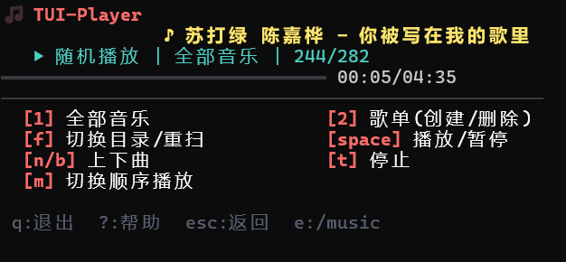
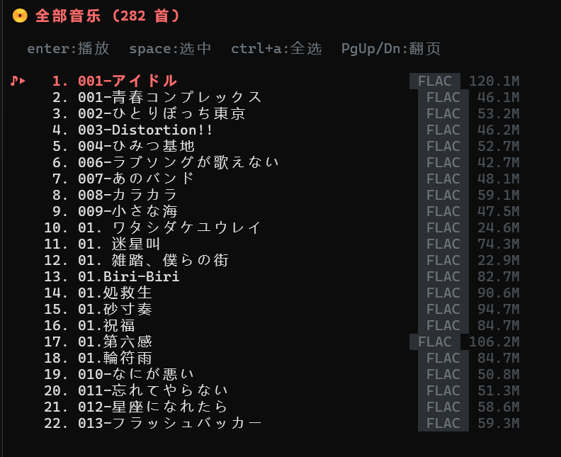
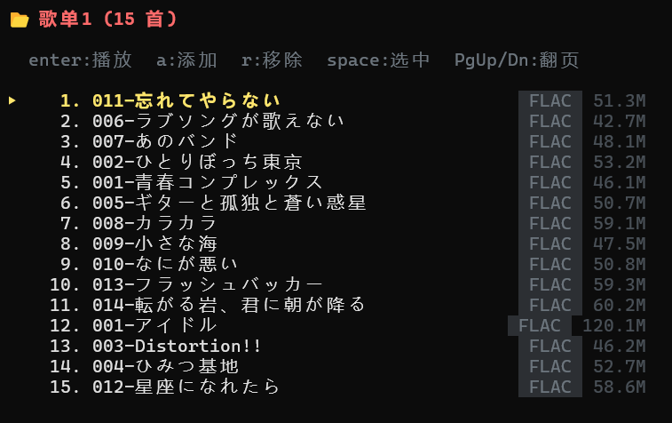

# 🎵 TUI-Player

> 跨平台命令行音乐播放器 | Cross-platform Terminal Music Player

[](https://go.dev/)
[](LICENSE)
[](#)

一个使用 Go 语言开发的终端界面（TUI）音乐播放器，支持 Windows 和 Linux 平台。基于 [Bubble Tea](https://github.com/charmbracelet/bubbletea) 框架构建，提供直观的键盘操作体验。

A terminal-based music player built with Go, supporting Windows and Linux. Powered by the [Bubble Tea](https://github.com/charmbracelet/bubbletea) framework for a smooth TUI experience.

---

## 📸 截图 | Screenshots

### 主界面 | Main Interface



*播放控制主界面，显示当前播放歌曲、进度条、音量控制和操作提示。*

*Main interface with playback controls, progress bar, volume control, and key bindings.*

### 全部歌曲 | All Songs



*浏览和管理所有扫描到的音乐文件。*

*Browse and manage all scanned music files.*

### 歌单管理 | Playlist Management



*创建、查看和管理自定义播放列表。*

*Create, view, and manage custom playlists.*

---

## ✨ 功能特性 | Features

- 🎶 **MP3 音频播放** — 基于 `go-mp3` 解码 + `oto` 音频输出
- 📂 **音乐目录扫描** — 自动扫描指定目录下的音乐文件
- 📋 **播放列表管理** — 创建/删除歌单，添加/移除歌曲
- 🔀 **多种播放模式** — 顺序播放、单曲循环、随机播放
- ⏪ **播放控制** — 播放/暂停、上一曲/下一曲、快进/快退
- 🔊 **音量控制** — 支持音量增减调节
- 📊 **进度显示** — 实时显示播放进度与时间
- 💾 **状态持久化** — 自动保存播放状态、歌单数据，下次启动自动恢复

---

## 🚀 快速开始 | Quick Start

### 前置要求 | Prerequisites

- [Go](https://go.dev/dl/) 1.25 或更高版本 | 1.25+ (理论上 1.21+ 也可，未测试)

### 安装 | Installation

```bash
# 克隆仓库 | Clone the repository
git clone https://github.com/viego-qiin/TUI-Player.git
cd TUI-Player

# 构建 | Build
go build -o tui-player ./cmd

# 运行（默认扫描当前目录）| Run (scans current directory by default)
./tui-player

# 指定音乐目录 | Specify a music directory
./tui-player -d /path/to/music
```

**Windows 用户 | Windows Users:**

```powershell
# 构建 | Build
go build -o tui-player.exe ./cmd

# 运行 | Run
.\tui-player.exe -d D:\Music
```

---

## 🎮 操作指南 | Key Bindings

| 按键 | 功能 |
|------|------|
| `↑` / `↓` | 上下移动选择 |
| `Enter` | 确认 / 播放选中歌曲 |
| `Space` | 播放 / 暂停 |
| `→` / `←` | 快进 / 快退 5 秒 |
| `+` / `-` | 增加 / 减小音量 |
| `s` | 切换播放模式（顺序 → 单曲循环 → 随机） |
| `a` | 查看全部歌曲 |
| `p` | 查看歌单列表 |
| `n` | 创建新歌单 |
| `d` | 删除歌单 |
| `o` | 切换目录 |
| `q` / `Esc` | 退出当前视图 / 返回 |
| `Ctrl+C` | 退出程序 |

---

## 📦 技术栈 | Tech Stack

| 组件 | 库 |
|------|----|
| TUI 框架 | [Bubble Tea](https://github.com/charmbracelet/bubbletea) |
| UI 组件 | [Bubbles](https://github.com/charmbracelet/bubbles) |
| 样式 | [Lipgloss](https://github.com/charmbracelet/lipgloss) |
| MP3 解码 | [go-mp3](https://github.com/hajimehoshi/go-mp3) |
| 音频输出 | [oto](https://github.com/hajimehoshi/oto) |

---

## 📁 项目结构 | Project Structure

```
TUI-Player/
├── cmd/
│   └── main.go           # 主入口
├── internal/
│   ├── audio/            # 音频解码与播放
│   ├── player/           # 播放器核心控制
│   ├── playlist/         # 播放列表管理
│   └── ui/               # 命令行用户界面
├── data/                 # 运行数据（状态、歌单）
│   ├── state.json
│   └── playlists/
├── image/                # 截图
├── go.mod
└── README.md
```

---

## 🔧 构建说明 | Build

```bash
# 构建当前平台 | Build for current platform
go build -o tui-player ./cmd

# 交叉编译 Windows | Cross-compile for Windows
GOOS=windows GOARCH=amd64 go build -o tui-player.exe ./cmd

# 交叉编译 Linux | Cross-compile for Linux
GOOS=linux GOARCH=amd64 go build -o tui-player ./cmd

# 运行测试 | Run tests
go test -v -race -coverprofile=coverage.out ./...
```

---

## 📄 许可证 | License

MIT License © 2025 viego-qiin

---

> **提示**：程序会自动保存播放状态和歌单数据到 `data/` 目录，下次启动时自动恢复。
>
> **Tip**: Playback state and playlists are auto-saved to the `data/` directory and restored on next launch.
